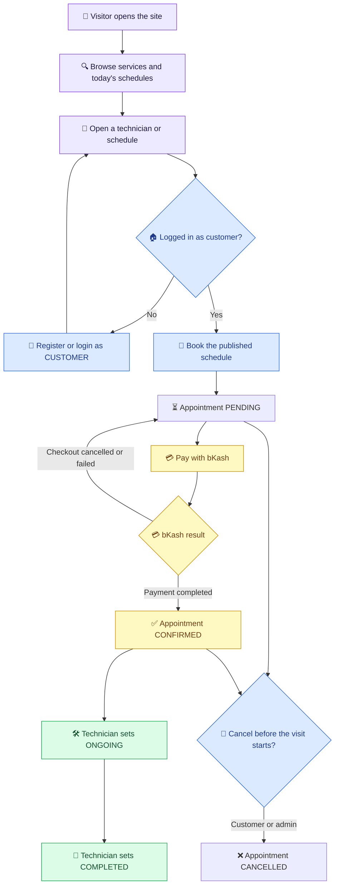
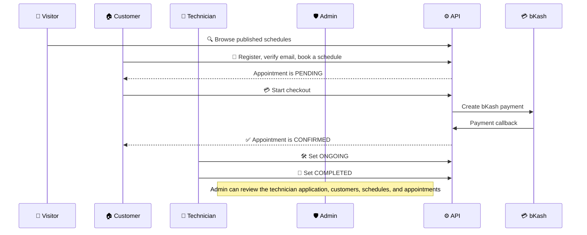
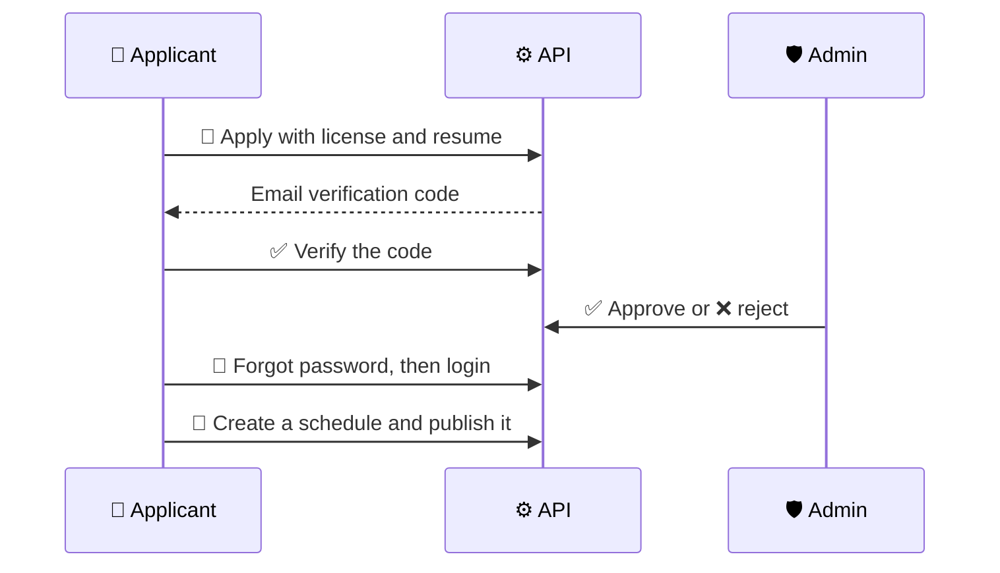
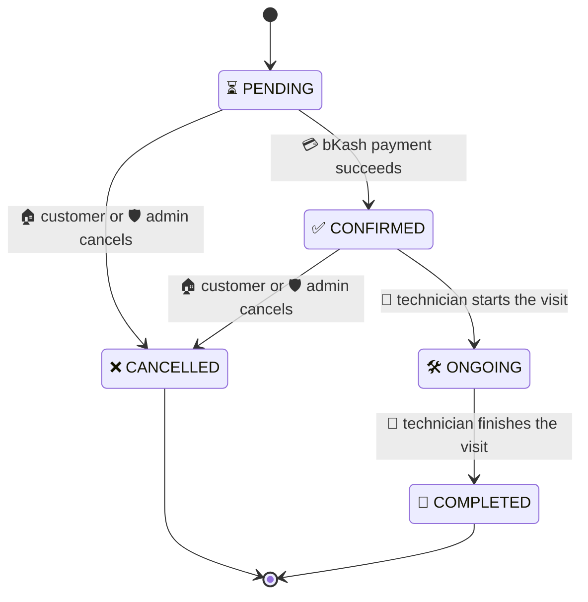
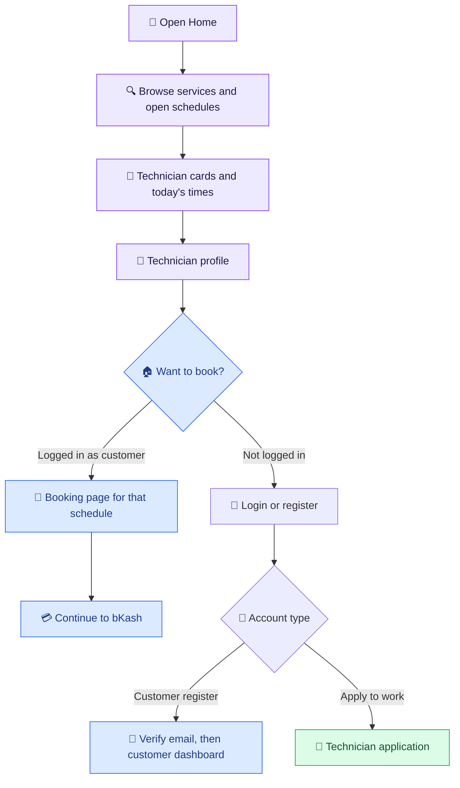
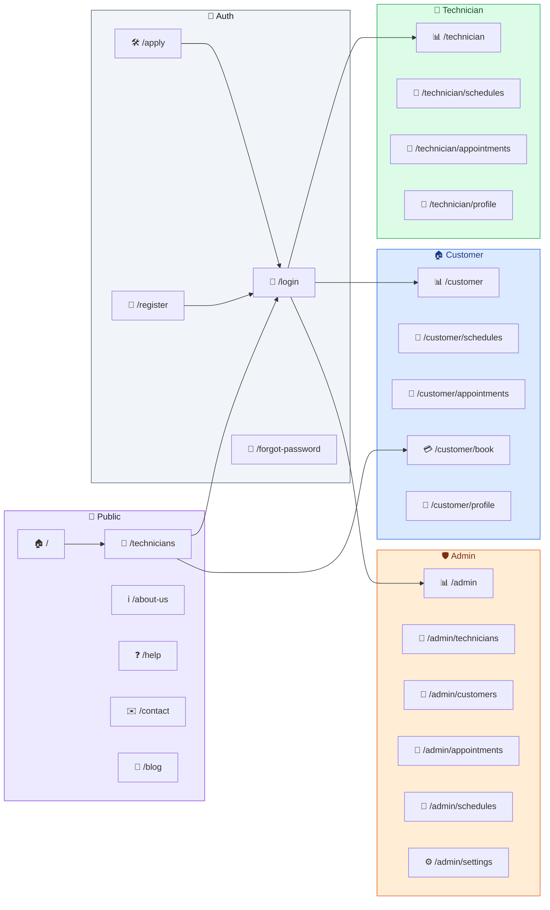

# 🔧 HandyHub — Frontend


A modern, responsive **Next.js** home-services marketplace. Customers book a verified technician, technicians publish the hours they can work, and admins approve applications and watch bookings — all through role-based dashboards.

[](https://handyhub-web.vercel.app)
[](https://handyhub-api-delta.vercel.app)

---

# HandyHub — Full Workflow

HandyHub connects customers with verified technicians. A visitor browses today's published schedules. A **customer** books an open slot and pays with bKash. A **technician** applies with a license, and after an **admin** approves that application, publishes hours and completes the visit.

Roles in the database: `CUSTOMER`, `TECHNICIAN`, `ADMIN`.
The public register form creates a `CUSTOMER`. A technician account is created from the apply form, then an admin approves it. Admin accounts are not created from the public register form.

## 1. One-look system flow



A second path runs beside booking: a person applies as a technician, verifies the email code, waits for admin approval, then sets a password and publishes a schedule. Customers can book that schedule only after it is `PUBLISHED` and still has an open slot.

---

## 2. How the three roles meet on one visit



Technician onboarding sits next to that visit:



---

## 3. Appointment status machine

A booked visit starts as `PENDING`. bKash success is the only step that confirms it. The technician then moves it forward one step at a time. `CANCELLED` and `COMPLETED` cannot move again.



What each status means:

| Status | Meaning | Who moves it |
|---|---|---|
| ⏳ `PENDING` | Slot is reserved. Payment is not confirmed yet | Created when the customer books |
| ✅ `CONFIRMED` | bKash payment succeeded | Payment callback |
| 🛠️ `ONGOING` | The technician has started the visit | Technician, and only from `CONFIRMED` |
| 🏁 `COMPLETED` | The visit is finished. Terminal | Technician, and only from `ONGOING` |
| ❌ `CANCELLED` | The visit was cancelled and the slot is returned. Terminal | Customer or admin, before `ONGOING` or `COMPLETED` |

A failed or abandoned checkout does not confirm the visit. The appointment stays `PENDING`, and the customer can pay again from My appointments.

Each schedule slot is 20 minutes. Booking a published schedule reserves one open slot. Cancelling gives that slot back.

A technician can keep one schedule per calendar day. A new schedule is a `DRAFT` until the technician publishes it. Customers only see and book schedules that are `PUBLISHED` and still have a slot later today.

---

## 4. Public user flow

Anyone can use the public site without an account.

Pages: `/`, `/technicians`, `/technicians/[techinicianId]`, `/about-us`, `/help`, `/contact`, `/blog`, `/privacy`, `/terms`.



Service cards filter technicians by the specialization they list, for example electrical, plumbing, cleaning, or appliance repair.

---

## 5. Where each role can go

| Step | 👀 Public visitor | 🏠 Customer | 🔧 Technician | 🛡️ Admin |
|---|:---:|:---:|:---:|:---:|
| Browse services, technicians, and help | Yes | Yes | Yes | Yes |
| Register from the site | Yes, as a customer | — | — | No |
| Apply with a license and resume | Yes | No | — | No |
| Book a published schedule | No | Yes | No | No |
| Pay with bKash | No | Own pending visit | No | No |
| Cancel a visit | No | Own visit, before it is ongoing | No | Any visit, before it is ongoing |
| Publish a daily schedule | No | No | After approval | No |
| Move a visit to ongoing, then completed | No | No | Own visits | No |
| Approve or reject a technician | No | No | No | Yes |
| View customers, appointments, and schedules | No | Own records | Own records | Yes |

---

## 6. Screen map



Open this file in a Markdown preview that supports Mermaid (Cursor, GitHub, or VS Code with a Mermaid extension) to see the diagrams rendered.

---

## 📋 Table of Contents

- [Overview](#-overview)
- [Live Links](#-live-links)
- [Tech Stack](#-tech-stack)
- [Roles & Permissions](#-roles--permissions)
- [Features](#-features)
- [Project Structure](#-project-structure)
- [Getting Started](#-getting-started)
- [Environment Variables](#-environment-variables)
- [Routes](#-routes)
- [API Integration](#-api-integration)
- [Payment Flow](#-payment-flow)
- [Demo Access](#-demo-access)
- [Author](#-author)

---

## 📖 Overview

HandyHub is a **frontend** Next.js application that talks to a separate backend REST API. It covers the visit lifecycle:

**Browse → Book → Pay with bKash → Visit → Complete**, across three roles — **Customer**, **Technician**, and **Admin**. The signed-in role decides which dashboard opens after login.

The same navbar is on the public pages, the auth pages, and the dashboards.

---

## 🔗 Live Links

| Resource | Link |
|---|---|
| **Live Frontend** | [handyhub-web.vercel.app](https://handyhub-web.vercel.app) |
| **Backend API** | [handyhub-api-delta.vercel.app](https://handyhub-api-delta.vercel.app) |
| **Project** | [github.com/kaziashik/handyhub](https://github.com/kaziashik/handyhub) |

---

## 🛠️ Tech Stack

- **Framework:** Next.js 16 (App Router) and React 19
- **Styling:** Tailwind CSS 4 and shadcn/ui
- **Forms and data:** TanStack Form, TanStack Query, Zod
- **HTTP:** ofetch, with cookies sent on each API call
- **Auth:** Email and password, email verification codes, Google sign-in
- **Payments:** bKash sandbox checkout
- **Package manager:** Bun

---

## 👥 Roles & Permissions

| Role | Description | UI Access |
|---|---|---|
| **Customer** | Books and pays for visits | Public browsing, booking, appointments, profile |
| **Technician** | Publishes hours and completes visits | Own schedules and appointments, after an admin approves the application |
| **Admin** | Reviews the platform | Technician applications, customers, appointments, schedules, settings |

> Customers register on `/register`. Technicians use `/apply`. After login, the app sends each role to `/customer`, `/technician`, or `/admin`.

---

## ✨ Features

### Public
- Home page with a service catalog, today's open schedules, and short guides
- Technician directory and profile pages
- About, Help, Contact, Blog, Privacy, and Terms
- Shared navbar, footer, and light/dark theme toggle

### Customer
- Register, verify the email code, and log in
- Book a published schedule that still has an open slot
- Pay a pending visit again with bKash
- Cancel before the visit is ongoing or completed
- Dashboard for schedules, appointments, and profile

### Technician
- Apply with specialization, license, experience, and a resume
- Verify the email code, then wait for approval
- After approval, set a password from Forgot password and sign in
- Create one schedule per day and publish it
- Mark a confirmed visit ongoing, then completed

### Admin
- Overview of platform numbers
- Approve or reject technician applications
- Lists of customers, appointments, and schedules
- Settings profile

---

## 📁 Project Structure

```
handyhub-fronted/
├── src/
│   ├── app/
│   │   ├── (public)/
│   │   │   ├── (marketing)/          # home, technicians, about, help, contact, blog
│   │   │   ├── (authentication)/     # login, register, apply, password reset
│   │   │   └── layout.tsx            # shared public navbar
│   │   ├── (dashboard)/              # /customer, /technician, /admin
│   │   ├── globals.css
│   │   └── layout.tsx
│   ├── api/                          # ofetch calls to /api/v1
│   ├── components/
│   │   ├── auth/
│   │   ├── dashboard/
│   │   ├── form/
│   │   ├── layout/
│   │   └── modules/
│   ├── content/                      # service catalog and guides
│   ├── lib/                          # API client, role redirects, demo accounts
│   ├── routes/
│   └── validation/
├── public/
│   ├── images/
│   └── logo.svg
├── .env.local                        # local secrets, gitignored
└── package.json
```

The API lives in the sibling `HandyHub Backand` app and is mounted at `/api/v1`.

---

## 🚀 Getting Started

### Prerequisites
- Bun 1.3+
- A running HandyHub API (local on port 5000, or the deployed API)

### Installation

```bash
cd handyhub-fronted
bun install
```

### Configure environment variables

Create `.env.local` in `handyhub-fronted`. See [Environment Variables](#-environment-variables). Do not commit that file.

### Run the dev server

```bash
bun run dev
```

Visit **http://localhost:3000**.

### Build for production

```bash
bun run build
bun start
```

---

## ⚙️ Environment Variables

Create `.env.local` in `handyhub-fronted`. **No secret values belong in this README.** Never commit `.env.local`.

| Variable | Scope | Used For |
|---|---|---|
| `NEXT_PUBLIC_API_URL` | Client | API origin in local development, for example `http://localhost:5000` |
| `NEXT_PUBLIC_GOOGLE_CLIENT_ID` | Client | Google sign-in button |

On the deployed Vercel site, the browser calls `/api/v1` on the same host, and Next.js rewrites that path to the HandyHub API. Local development uses `NEXT_PUBLIC_API_URL` instead.

The API process keeps its own server secrets (database, JWT, email, and bKash). Those stay in the backend environment and are not listed here.

---

## 🗺️ Frontend Routes & API Integration

| Next.js Route | What it does | Backend |
|---|---|---|
| `/` | Home, services, and today's open schedules | `GET /api/v1/schedule/todays-schedule` |
| `/technicians` | Browse technicians, optional specialization filter | `GET /api/v1/techinician/public` |
| `/technicians/[techinicianId]` | One technician profile | `GET /api/v1/techinician/public/:id` |
| `/register` | Create a customer account | `POST /api/v1/auth/register` |
| `/account-verify` | Enter the customer email code | `POST /api/v1/auth/verify-email` |
| `/login` | Email login, demo cards, Google sign-in | `POST /api/v1/auth/login`, `POST /api/v1/auth/google` |
| `/forgot-password` and `/reset-password` | Set a password from an email code | `POST /api/v1/auth/forgot-password`, `POST /api/v1/auth/reset-password` |
| `/apply` | Technician application and resume upload | `POST /api/v1/techinician/apply` |
| `/apply/verify` | Confirm the technician email code | technician verify-email route |
| `/customer/book` | Confirm a schedule and start payment | `POST /api/v1/appointment/book-appointment` |
| `/customer/appointments` | Own visits, including pay again | `GET /api/v1/appointment/my-appointments`, `POST /api/v1/appointment/pay-appointment` |
| `/technician/schedules` | Create and publish the day's hours | `POST /api/v1/schedule`, `PATCH /api/v1/schedule/publish-schedule/:id` |
| `/technician/appointments` | Start and complete own visits | `PATCH /api/v1/appointment/update-status/:id` |
| `/admin/technicians` | Approve or reject applications | technician admin routes |
| `/contact` | Send a message to the HandyHub inbox | `POST /api/v1/contact` |

> Public pages are open. Dashboard routes load only for a signed-in user, and the sidebar matches that user's role.

---

## 🔌 API Integration

The browser client in `src/lib/api-client.ts` sends cookies with every request.

- **Public:** technicians, today's schedules, contact
- **Auth:** register, verify email, login, logout, refresh, forgot and reset password, Google
- **Technician:** apply, verify email, admin approve or reject
- **Schedules:** create, update, publish, list today's published rows
- **Appointments:** book, pay, payment callback, cancel, list, update status
- **Analytics:** overview numbers on the dashboards

---

## 💳 Payment Flow

HandyHub uses the **bKash sandbox** for the visit fee. The appointment is created first. Payment confirms it.

| Step | Appointment | Payment |
|---|---|---|
| Customer books a published schedule | `PENDING` | `UNPAID` |
| Customer opens bKash checkout | `PENDING` | checkout in progress |
| bKash reports success | `CONFIRMED` | `PAID` |
| Checkout is cancelled or fails | `PENDING` | not paid; the customer can start checkout again |
| Customer or admin cancels in time | `CANCELLED` | a paid visit may be refunded when it is cancelled more than one hour before the start |
| Technician finishes the visit | `COMPLETED` | stays paid |

```text
Published schedule with an open slot
        ↓
Customer books
        ↓
PENDING
        ↓
bKash checkout
        ↓
CONFIRMED
        ↓
ONGOING
        ↓
COMPLETED
```

A pending visit can be paid again from My appointments. Cancelling before the visit is ongoing returns the slot to the schedule.

---

## 🔑 Demo Access

The login page has **Quick demo access** cards. Choosing a card fills the email and password for that account.

| Card | Role | Email | Password |
|---|---|---|---|
| User | Customer | `user@gmail.com` | `User@demo12345` |
| Technician | Technician | `testertechinian@gmail.com` | `Tester@techinian12345` |
| Admin | Admin | `testeradmin@gmail.com` | `Tester@admin12345` |
| Super admin | Admin | `superadmin@gmail.com` | `Super@admin12345` |

These are demo sign-ins for the running app. They are not production secrets for the database, email, or bKash.

---

## 👤 Author

**Kazi Ashik**

© 2026 HandyHub. Built by Kazi Ashik.
